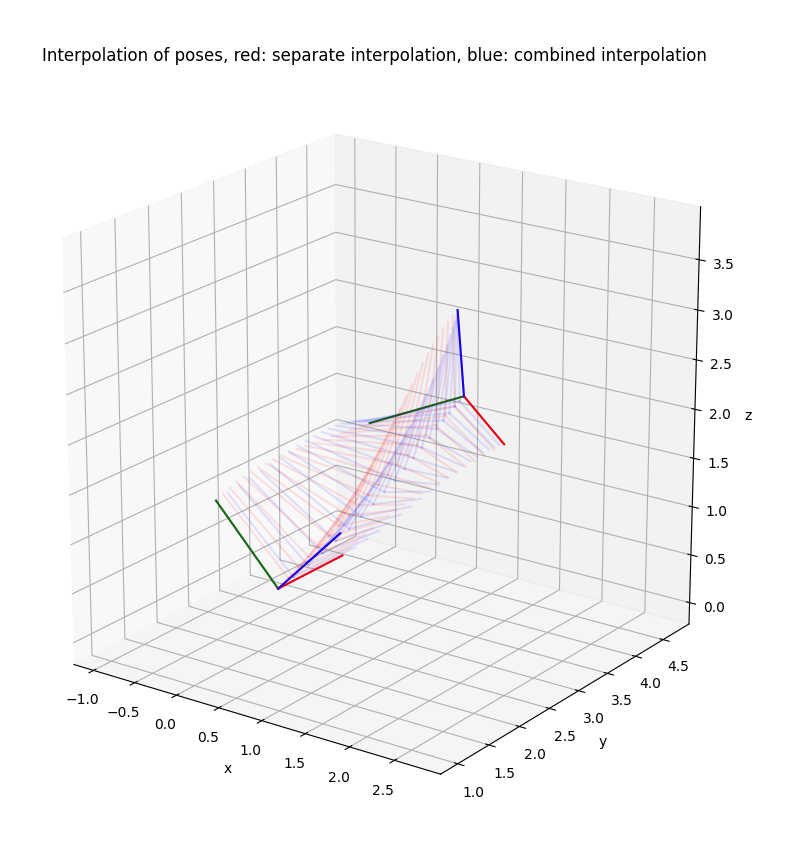
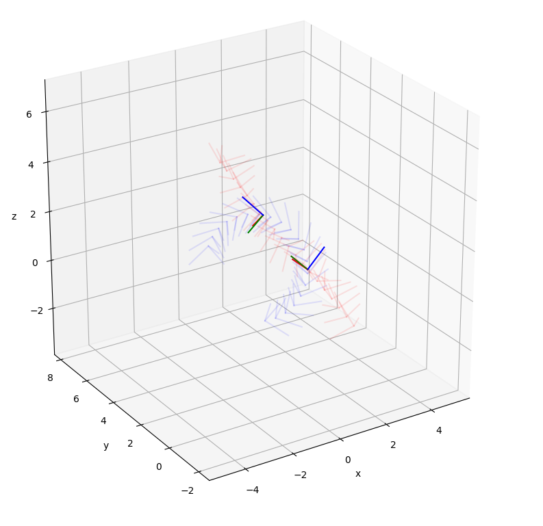
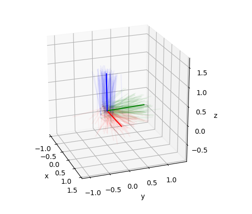
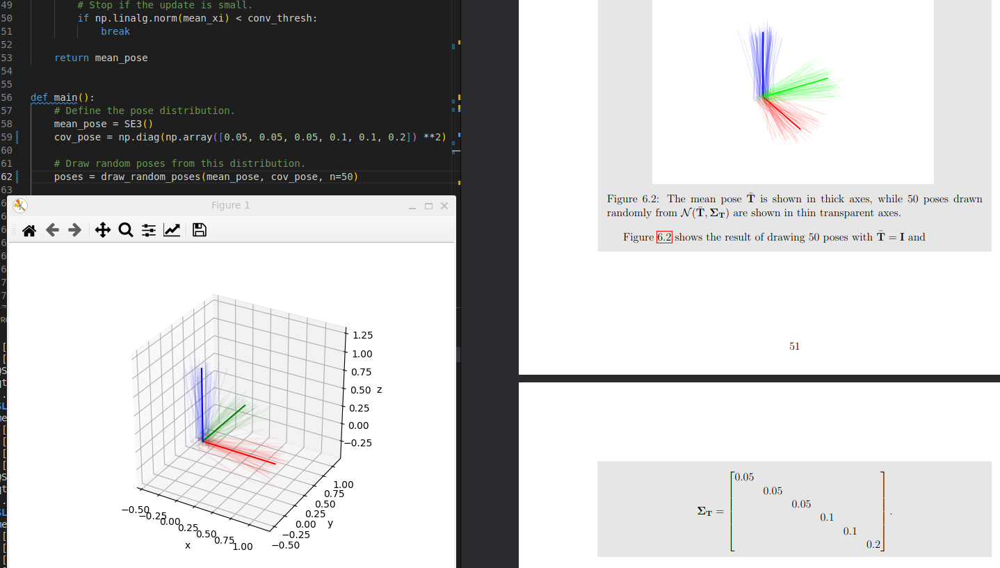
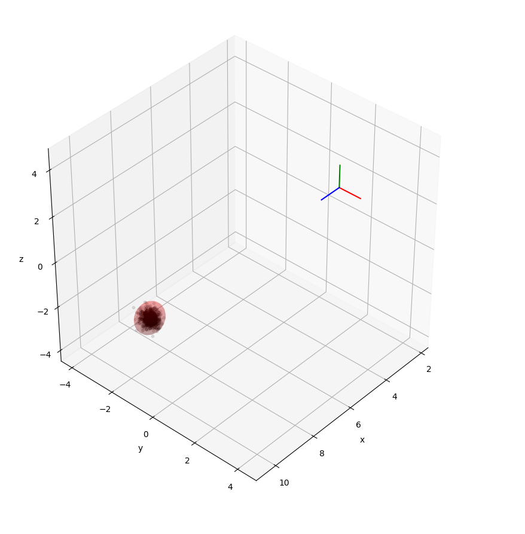
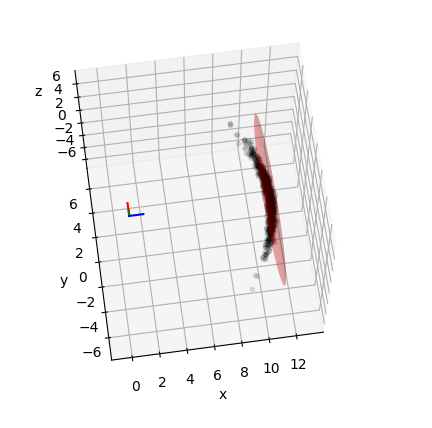
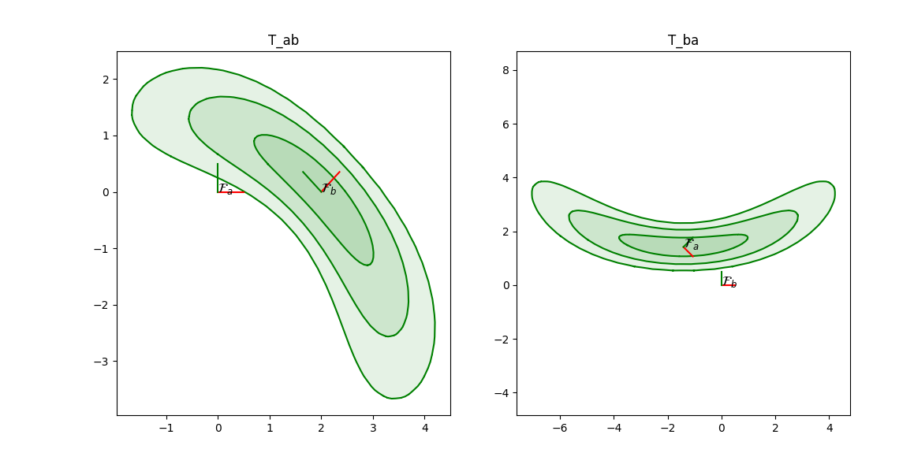
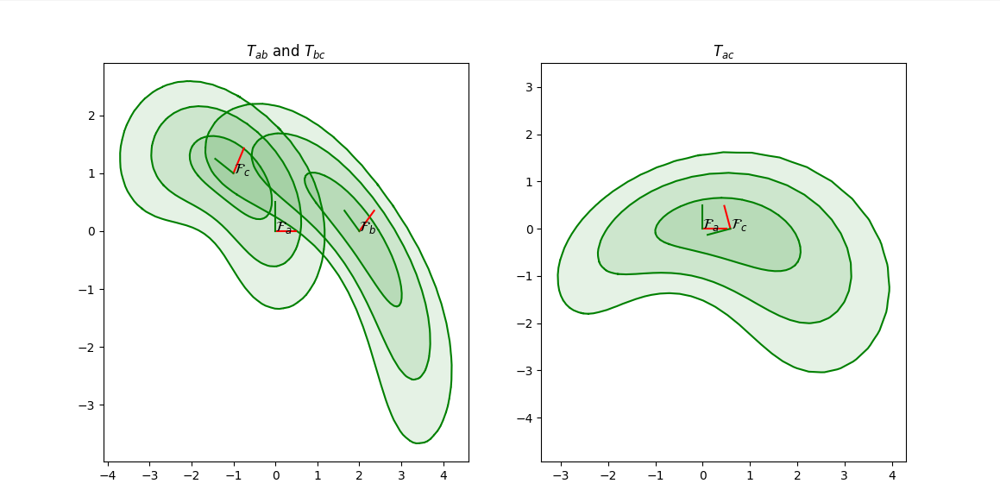
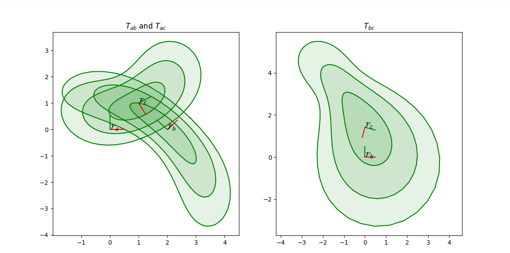

# Lab 3 - An introduction to Lie theory

Welcome to Lab 3!
We will here play around with some of the tools we get from Lie theory in practice.

I have made the following scripts:
- [ex1_interpolation.py](ex1_interpolation.py)
- [ex2_mean_pose.py](ex2_mean_pose.py)
- [ex3_noise_propagation.py](ex3_noise_propagation.py)
- [ex4_distributions.py](ex4_distributions.py)

Your task this week is to finish these scripts, and then experiment with them to get a better understanding of how Lie theory can be used to work with poses on the manifold.
See the sections below for details.

The exercises are based on [visgeom](https://github.com/tussedrotten/visgeom), and [pylie](https://github.com/tussedrotten/pylie).
You can install all dependencies using `pip`:
```bash
pip install -r requirements.txt
```

## Exercise 1 - Linear interpolation of poses on the manifold

Using [pylie](https://github.com/tussedrotten/pylie), we can quite easily implement linear interpolation for poses on the manifold.
For hints, see Example 4.8 in the compendium.

- Open [ex1_interpolation.py](ex1_interpolation.py).
- Implement linear interpolation on the manifold (see TODO 1) 
- Play around with different poses and see how the interpolation is performed
- Try extrapolating
- Instead of interpolating on the pose manifold, try instead to interpolate the rotation and translation parts separately.
  How does this procedure compare to the full pose interpolation?

  Easy to interpolate using Manifold + and -

  When combining for the pose you get the interaction leading to screw motion, as in picture .
  One can not just move along the straightest path.
  
  Extrapolating this effect gets even more obvious 
  

## Exercise 2 - Estimate the mean pose from a set of random poses

We will here draw poses from a distribution, and try to recover the mean pose by estimating it on the manifold.
For hints, see Examples 6.17 and 7.20 in the compendium. 

- Open [ex2_mean_pose.py](ex2_mean_pose.py)
- Finish `draw_random_poses()` (see TODO 1)
- Study algorithm 2 in Example 7.20 in the compendium.
- Finish `compute_mean_pose()` (see TODOs 2 and 3)

- Play around with different distribution parameters.
  Try for example to increase the uncertainty in the rotation around the y-axis.

  

  The covariance should be squared in example 6.17 in the compendium.
  Or else my code is wrong. 
  
## Exercise 3 - Propagating uncertainty in backprojection

We will here estimate the distribution of an observed 3D point in the world, based on uncertainties in measured camera pose, pixel position, and depth. 
For hints, see Examples 6.19 in the compendium. 

- Open [ex3_noise_propagation.py](ex3_noise_propagation.py).
- Finish `backproject()` (see TODO 1).
- Implement uncertainty propagation (see TODO 2).
  Some of the Jacobians involved are implemented in [pylie](https://github.com/tussedrotten/pylie).

  Here is the first test with working code:



- Play around with different distribution parameters.
  Try for example to increase the uncertainty in the camera rotation around the y-axis to a large value (0.2 for example).


This leads to a very large uncertainty in the backprojection. But the approximation is not that good. Since it curves. There are coupling effects between the rotation and the translation.


- When is this first order approximation to the distribution a good approximation? When is it bad?
When the jacobian is non singular. Or when the Hessian is approximated by the Jacobian.T @ Jacobian. This happens close to the minimum of the function.

### Bonus task Implement Unscented Kalman Filter for the backprojection

Gave up :( for now

## Exercise 4 - Experimenting with distributions on the manifold

Play with distributions on the _SE_(2) manifold and experience how the look like in the plane.

- Open [ex4_distributions.py](ex4_distributions.py).
- Test different expected poses and covariances
- Try propagating distributions through the inverse, compositions and the relative pose

The inverse \\


The composition \\


Probably wrong


The relative pose \\



From VSLAM-handbook.  